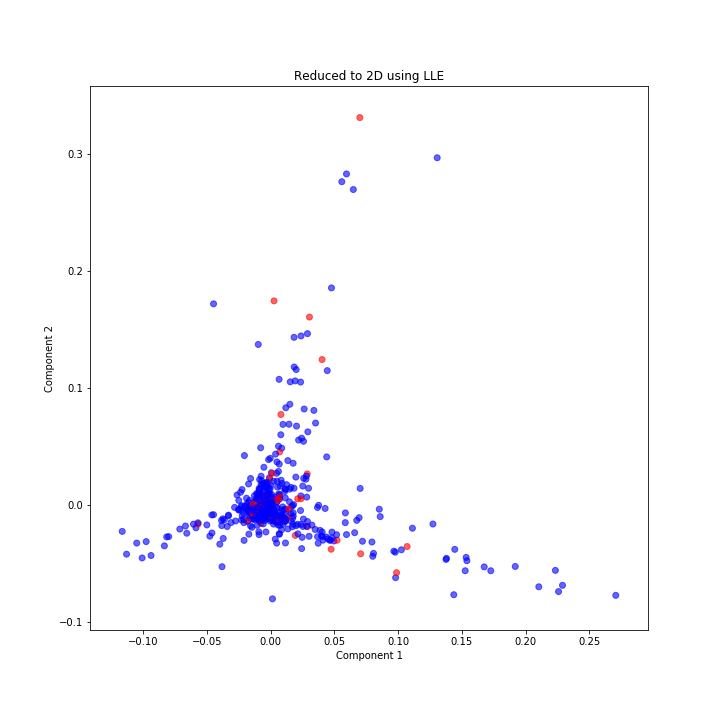
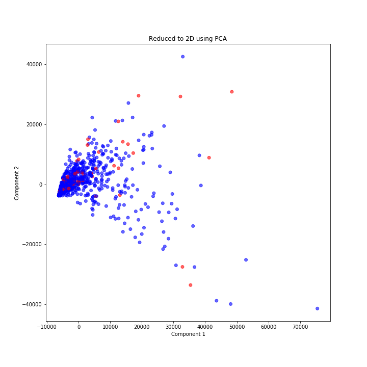

[](http://quantlet.de/)

## [](http://quantlet.de/) **LLE_AOBDL** [](http://quantlet.de/)

```yaml

Name of QuantLet:   LLE_AOBDL

Published in:       ''

Description:        'Plotting the Antisocial Online Behavior using LLE'

Keywords:
 - plot
 - LLE
 - cyberbullying
 - visualization
 - dimensionality reduction

Author:             Elizaveta Zinovyeva

Submitted:          Mon, February 10 2020 by Elizaveta Zinovyeva

Output:             'LLE_reduce_AOBDL.png'

```





### [IPYNB Code: LLE_AOBDL.ipynb](LLE_AOBDL.ipynb)


automatically created on 2020-02-19