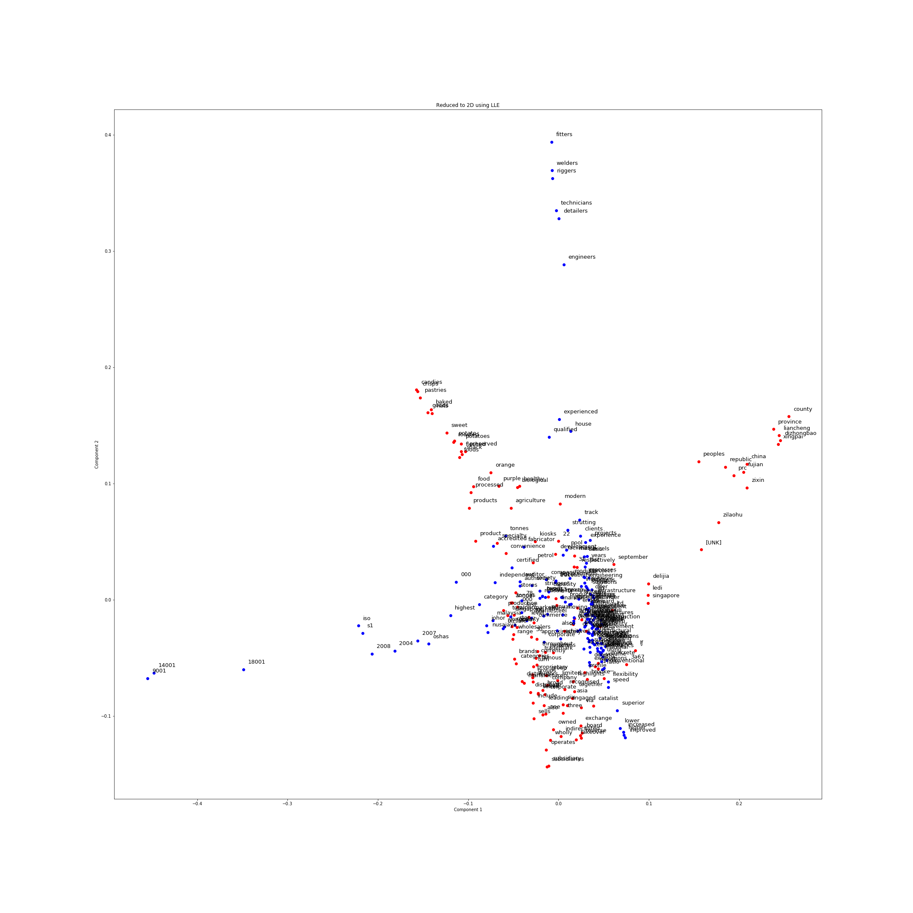

[](http://quantlet.de/)

## [](http://quantlet.de/) **LLE_Firm_Reports** [](http://quantlet.de/)

```yaml

Name of QuantLet:   LLE_Firm_Reports

Published in:       ''

Description:        'Plotting the 2 company reports using LLE'

Keywords:
 - plot
 - LLE
 - firm report
 - visualization
 - dimensionality reduction

Author:             Elizaveta Zinovyeva

Submitted:          Mon, February 10 2020 by Elizaveta Zinovyeva

Output:             'LLE_reduce_AOBDL.png'

```



### [IPYNB Code: LLE_Firm_Reports.ipynb](LLE_Firm_Reports.ipynb)


automatically created on 2020-02-11