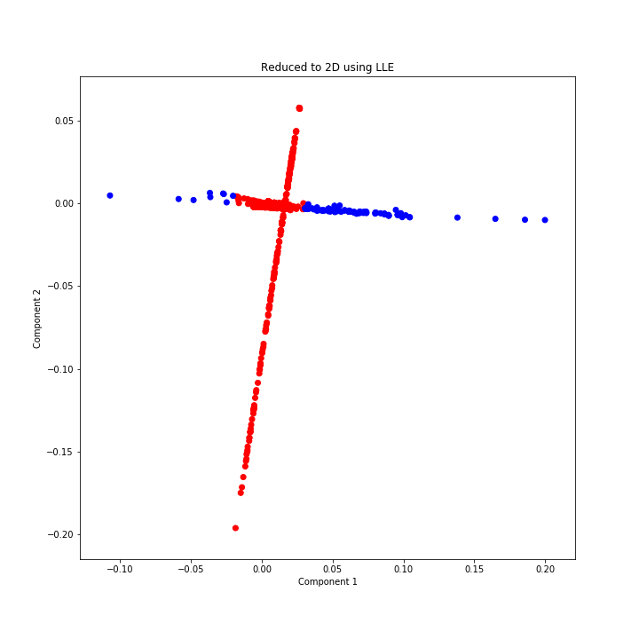

[](http://quantlet.de/)

## [](http://quantlet.de/) **LLE_Quantlet** [](http://quantlet.de/)

```yaml

Name of QuantLet:   LLE_Quantlet

Published in:       ''

Description:        'Quantlet data reduction with PCA and LLE'

Keywords:          
 - plot
 - LLE 
 - PCA
 - quantlet
 - visualization
 - dimensionality reduction

Author:             Elizaveta Zinovyeva

Submitted:          Tue, January 28 2020 by Elizaveta Zinovyeva

Output:             'LLE_reduce_quantlets.png, images/*.png'

```



### [IPYNB Code: LLE_Quantlet.ipynb](LLE_Quantlet.ipynb)


automatically created on 2020-01-29