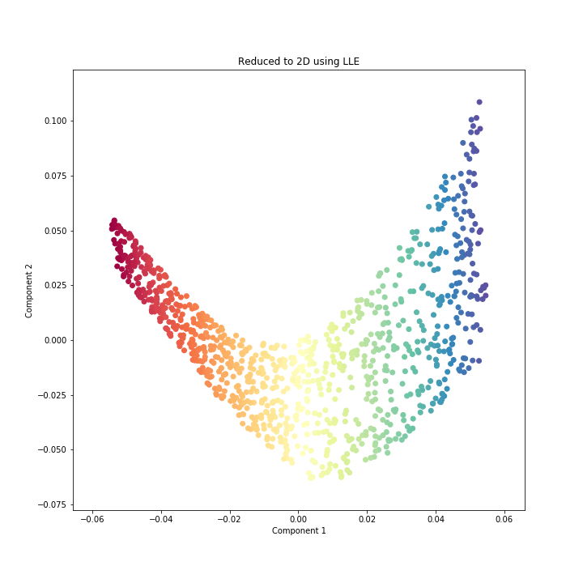
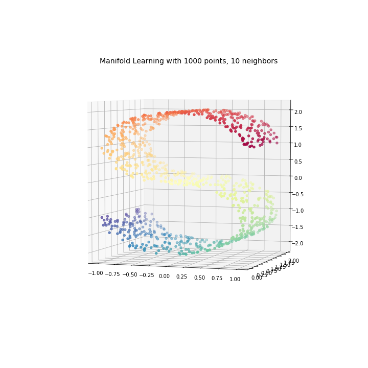
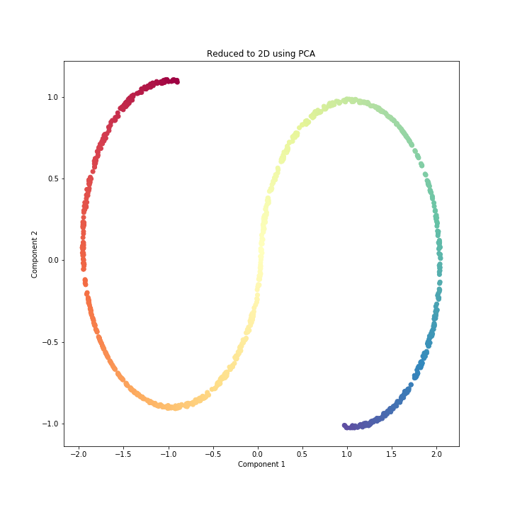
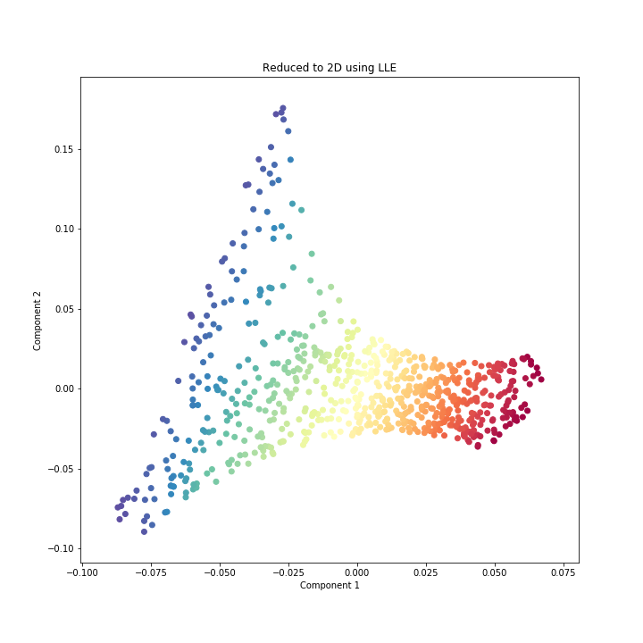
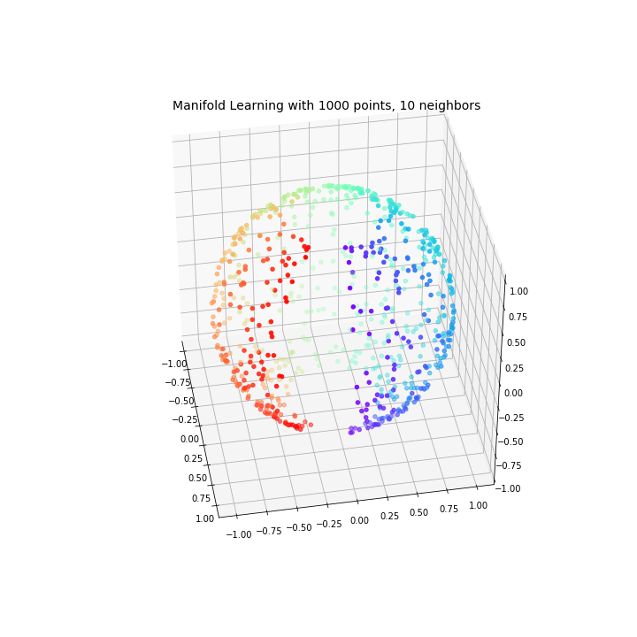
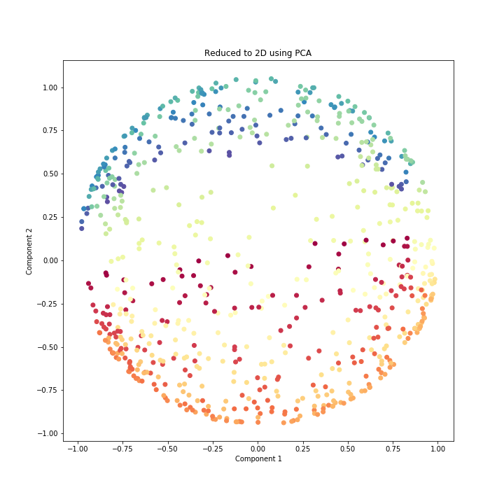

[](http://quantlet.de/)

## [](http://quantlet.de/) **LLE_S** [](http://quantlet.de/)

```yaml

Name of QuantLet:   LLE_S

Published in:       ''

Description:        'Plotting the S and sphere and reduction using LLE'

Keywords:
 - plot
 - LLE
 - S
 - sphere
 - visualization
 - dimensionality reduction

Author:             Elizaveta Zinovyeva

Submitted:          Mon, February 10 2020 by Elizaveta Zinovyeva

Output:             'S_original_data.png, S_pca_reduce.png, S_LLE_reduce.png, sphere_original_data.png, sphere_LLE_reduce.png, sphere_spca_reduce.png'

```













### [IPYNB Code: LLE_S.ipynb](LLE_S.ipynb)


automatically created on 2020-02-11