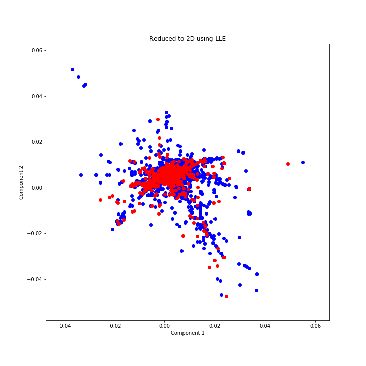
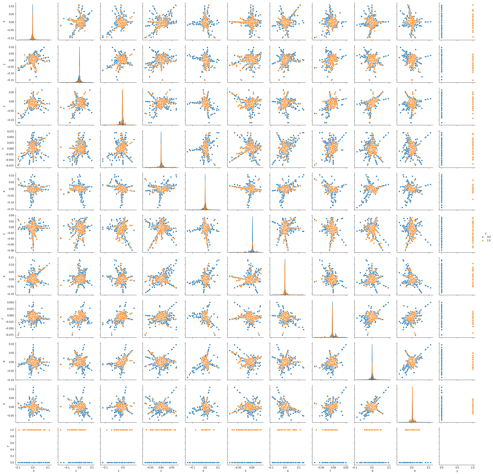

[](http://quantlet.de/)

## [](http://quantlet.de/) **LLE_p2p** [](http://quantlet.de/)

```yaml

Name of QuantLet:   LLE_p2p

Published in:       ''

Description:        'Plotting the p2p lendings using LLE'

Keywords:
 - plot
 - LLE
 - p2p
 - visualization
 - dimensionality reduction

Author:             Elizaveta Zinovyeva

Submitted:          Tue, February 11 2020 by Elizaveta Zinovyeva

Output:             'LLE_reduce_AOBDL.png'

```





### [IPYNB Code: LLE_p2p.ipynb](LLE_p2p.ipynb)


automatically created on 2020-02-19